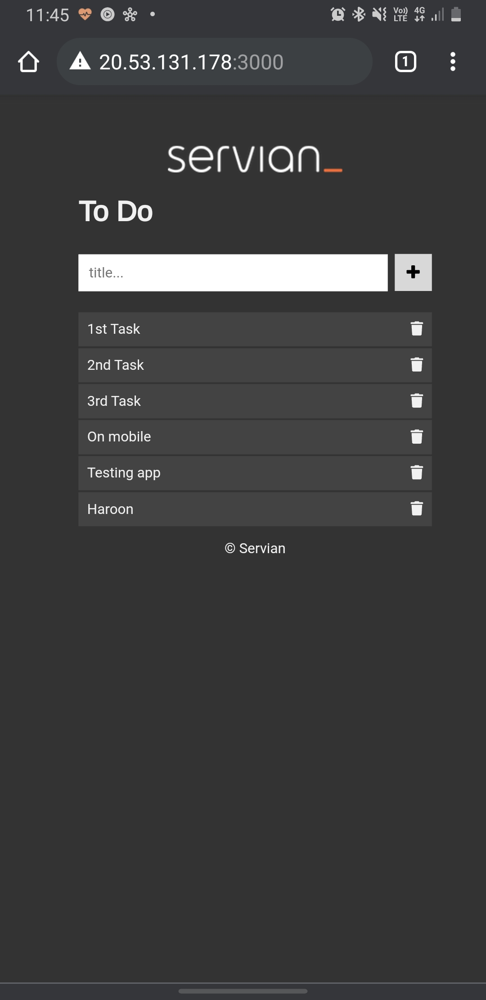

# Cloud Solution to the Servian TechChallenge

## Solution
For this solution, I deployed the application on Azure with AKS using Terraform on a 2-node cluster with autoscaling enabled.
*Pre-requisites include Azure CLI, Terraform and the AKS cli (kubectl). If using Cloud Shell, these are pre-installed.*

Ideally I would be using the Kubernetes provider in Terraform to also then deploy the application inside the cluster, as well as use Azure Container Registry for the images and a service principal to manage the authentication for it. For the purpose of this challenge, I am using kubernetes config files located [here](k8s-cluster/). To test the deployment locally I used docker-compose.

A few changes that I made are as below:
1. Rebuilt the docker image to contain the database perimeters.
2. Used golang:1.15-alpine image. Was unable to figure out the issue otherwise.
3. Added the provided dependencies within the docker file.
4. The image used for this webapp was uploaded to dockerhub. File: > haroondogar/techchallengeapp:1.0
5. Within the Kubernetes deployment, an initContainer is added to the webapp deployment that waits for a few seconds before creating the webapp container, allowing the database deployment to complete first as the [updatedb] task, from within the app, requires for a database to already exist to run successfully.
 
### Screenshot for application tested locally

### Screenshot for application tested through Azure (public address)

 

Step-by-step on deployment:
1. Clone the repo and change directory to [iac](iac/) in Azure CLI/.
2. Set the context using Azure CLI to the correct subscription if not set by default.
3. Initiate Terraform and perform plan and apply. This will create the number of required nodes. The below commands can also be seen as part of the Terraform output.

        Run the following command to connect to the kubernetes cluster:
        
        $ az aks get-credentials --resource-group serviantechchallenge --name k8-cluster-1
        
        Set the /.kube config as default
        
        $ export KUBECONFIG=~/.kube/config
        
        Test configuration using kubectl
        
        $ kubectl get nodes
        
        Run the following command to deploy the application:
        
        $ kubectl apply -f https://github.com/Haroon-1/TechChallengeApp/raw/master/k8s-cluster/all-deployments-and-svc.yaml
        
        Run the following command to set autoscaling:
        
        $ kubectl apply -f https://github.com/Haroon-1/TechChallengeApp/raw/master/k8s-cluster/autoscaler.yaml

###Video demo on the autoscaler:
![video]https://youtu.be/pdE5YpcqUSQ
