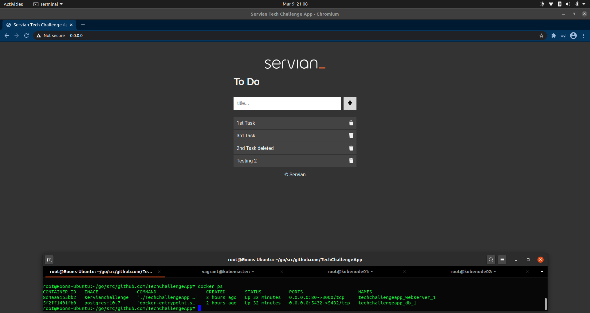

# Cloud Solution to the Servian TechChallenge

## Tested the application locally
Rebuilt the application in docker to contain the database perimeters. 
Used golang:1.15-alpine image to avoid GO111Module issues in the latest version.
Added dependencies within the docker file.
 
### Screenshot for application tested locally

### Screenshot for application tested through Azure (public address)

## Deployed the application on Azure with AKS using Terraform on a 2-node cluster with autoscaling enabled.
Pre-requisites include Azure CLI, Terraform and the AKS cli (kubectl). If using Cloud Shell, these are pre-installed.
Ideally I would be using the Kubernetes provider in Terraform, but for this demo I have created two YAML files here.[first entry](k8s-cluster/)

###Step-by-step on deployment:
1. Clone the repo and change directory to iac.
2. Set the context using Azure CLI to the correct subscription.
3. Initiate Terraform and perform plan and apply. This will create the number of required nodes. The below commands can also be seen as part of the Terraform output.

        Run the following command to connect to the kubernetes cluster:
        
        $ az aks get-credentials --resource-group serviantechchallenge --name k8-cluster-1
        
        Set the /.kube config as default
        
        $ export KUBECONFIG=~/.kube/config
        
        Test configuration using kubectl
        
        $ kubectl get nodes
        
        Run the following command to deploy the application:
        
        $ kubectl apply -f https://github.com/Haroon-1/TechChallengeApp/raw/testing-app/k8s-cluster/deployment.yaml
        
        Run the following command to set autoscaling:
        
        $ kubectl apply -f https://github.com/Haroon-1/TechChallengeApp/raw/testing-app/k8s-cluster/autoscaler.yaml

###Video demo on the autoscaler:

